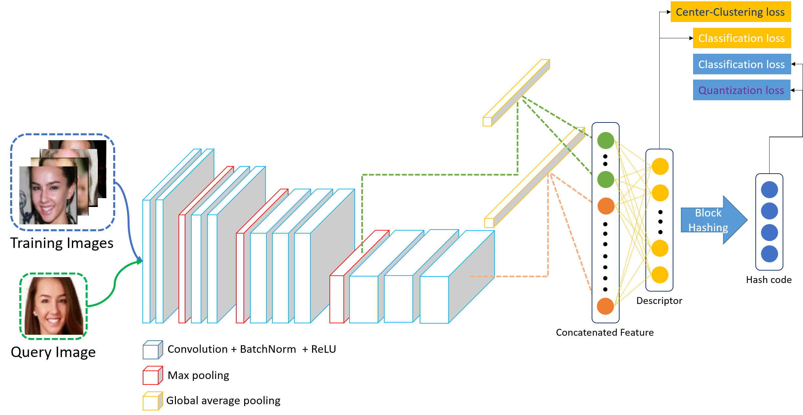

# Deep Clustering and Block Hashing Network for Face Image Retrieval
Tensorflow implementation of DCBH    
Accepted to ACCV 2018

## Abstract

This paper presents a new hashing method to learn the compact binary codes for implementing a large-scale face image retrieval system. Since it is very diffcult to deal with the inter-class similarities (similar appearance between different persons) and intra-class variations (same person with different pose, facial expressions, illuminations) in face-related problems, we propose a new deep clustering and block hashing (DCBH) approach to alleviate these issues. The network we adopt for the feature extraction is the VGG, where we design a new loss function to learn the robust and mulit-scale facial features for addressing the above-stated problems. Specifically, we design a center-clustering loss term to minimize the distance between the image descriptors belonging to the same class. Besides, the classification errors of the image descriptors and the learned binary codes are minimized to learn the discriminative binary codes. In addition, we introduce a block hashing layer for reducing the redundancy among hash codes and the number of parameters simultaneously without loss of similarity. Extensive experiments on two large scale face image datasets demonstrate that our proposed method outperforms the state-of-the-art face image retrieval methods.

<p align="center"></p>

## Overall Architecture

<p align="center"></p>

## How to use

### 1. Install requirements on your environment.
- Ubuntu=16.04
- Tensorflow=1.14
- Tflearn=0.5.0
- Numpy=1.16.6

### 2. Preparation.
- Thanks to the author of DDH (IJCAI 2017), face retrieval datasets can be found in <a href="https://github.com/xjcvip007/DDH">link</a>
- Make sure the tree seems as:  
```
|--DCBH-master
   |--data
      |--test_vec_folder_32_32
      |--test_folder_facescrub
      |--train_vec_folder_32_32
      |--train_folder_facescrub
```
### 3. Train and Test
- Modify `dataset_flag` in the `main.py` to select the face retrieval dataset for training and test.
- Run `main.py`

## Citation
```
@InProceedings{DCBH,
  title={Deep clustering and block hashing network for face image retrieval},
  author={Jang, Young Kyun and Jeong, Dong-ju and Lee, Seok Hee and Cho, Nam Ik},
  booktitle={Asian Conference on Computer Vision},
  pages={325--339},
  year={2018},
  organization={Springer}
}
```

## Contacts

Youngkyun Jang: kyun0914@ispl.snu.ac.kr
